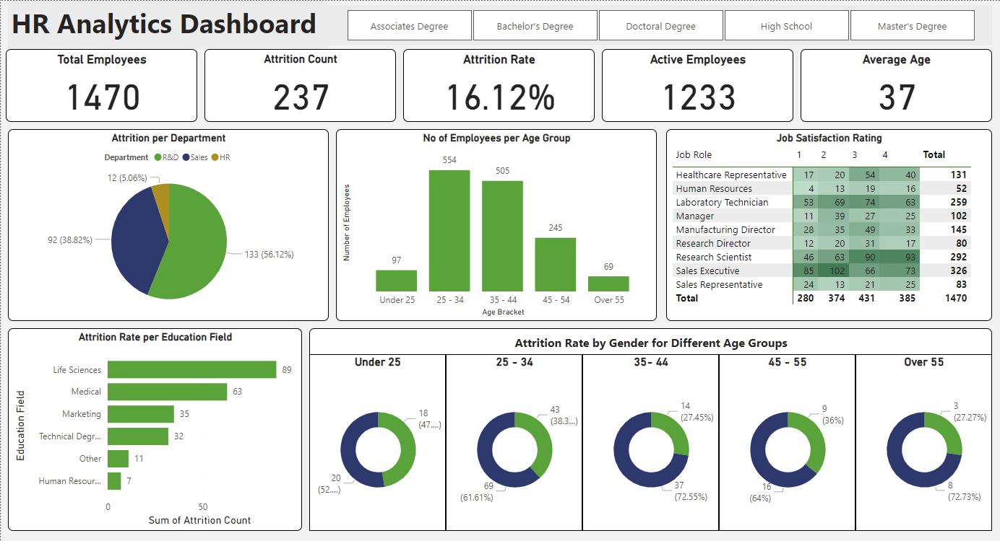

# Human Resource Data Project



# Objective

* Key objectives for this project

The Human Resources (HR) department want an interactive dashboard that reports several key performance indicators regarding employee attrition. They want this so they can understand the attrition of ex-employees, and they have asked for several KPIs and charts that the dashboard should contain.

Ideal dashboard
The ideal dashboard should provide the relevant insights into the business, which includes key performance indicators such as;

* Employee Count - They want to know how many employees they have, so they can assess the workforce size and plan for future growth or downsizing effectively
* Attrition Count - The organisation lacks a method to track attrition, resulting in incomplete and unreliable data on the number of employees who have left
* Attrition Rate - This is so they can assess the overall turnover level or compare it with the industry benchmark
* Active Employees - This is so they can know how many current active employees are working for the organisation
* Average Age - The HR department lacks visibility into the average age of employees, making it difficult to evaluate workforce demographics, succession planning, and the organisations ability to attract and retain younger talent

These KPIs will provide insightful information which the stakeholders can use, but the dashboard should also contain trends and insightful information, such as:

* Attrition by Gender - They want to know the attrition by gender, so they can identify any gender-related disparities and implement targeted retention strategies
* Department-wise Attrition - The HR department currently does not know the attrition by department, this hinders their ability to identify departments with higher attrition rates and address any underlying issues or concerns effectively
* Number of Employees by Age Group: They want to analyse the distribution of employees by age group, this helps understanding workforce demographics, identifying any age-related gaps or imbalances, and implementing targeted HR policies or programs
* Job Satisfaction Ratings - The HR department lacks visualisations to represent job satisfaction ratings, hindering their ability to measure employee engagement and overall job satisfaction levels effectively

# User story

As the head of the human resources department, I want to identify key performance indicators and trends regarding the past and current workforce, and specifically regarding attrition. This is so, we can make data driven decisions on the future on how to retain and attract talent.

# Data Source

What data is needed to achieve the objectives?

* Count of employees
* Current or ex-employee
* Age band
* Gender
* Department
* Education field
* Job role
* Attrition
* Job satisfaction

The stages for this project will be;
  * Design
  * Development
  * Testing
  * Analysis

What should the dashboard contain?
The dashboard should contain several visualisations, such as:

* Total Employees
* Attrition Count
* Attrition Rate
* Active Employees
* Average Age
* Attrition by Department (Pie chart)
* Number of Employees per Age Group (Bar chart)
* Job Satisfaction Rating (Table)
* Attrition Rate per Education Field (Bar chart)
* Attrition Rate by Gender per Age Group (Donut chart)

# Development
## Pseudocode
What is the approach you will use to create a solution from start to finish?

1. Get the data
2. Explore and Load the data into SQL
3. Test the data with SQL
4. Visualise the data in Power Bi
5. Generate the findings based on the insights
6. Write the documentation
7. Publish the data to GitHub

# SQL Queries
I used SQL to test the data and gather the Key Performance Indicators and trends that are needed for the dashboard

## Key Performance Indicators Test
```sql
/*
	The HR Department want to gather several KPIs
	1. Total Employees	- Expected 1470 (Passed)
	2. Attrition Count	- Expected 237 (Passed)
	3. Attrition Rate	- Expected 16% (Passed)
	4. Active Employees	- Expected 1233 (Passed)
	5. Average Age		- Expected 37 (Passed)
*/

-- 1. Total employees
SELECT
	COUNT(emp_no) AS [Total Employees]
FROM hrdata;

-- 2. Attrition count
SELECT
	COUNT(active_employee) AS [Attrition Count]
FROM hrdata
WHERE active_employee = 0;

-- 3. Attrition Rate
SELECT 
    ROUND(
        (CAST(COUNT(CASE WHEN attrition = 'Yes' THEN 1 END) AS FLOAT) / 
        (SELECT COUNT(*) FROM hrdata)) * 100, 
    2) AS [Attrition Rate %]
FROM hrdata;

-- 4. Active Employees
SELECT
	COUNT(active_employee) AS [Active Employee]
FROM hrdata
WHERE active_employee = 1;

-- 5. Average Age
SELECT
	ROUND(AVG(age),0) AS [Average Age]
FROM hrdata;
```
## Trends Test
```sql
/*
	The HR team wants the dashboard to show several insights:
	1. Attrition per Department - (Passed)
	2. Number of Employees per Age Group - (Passed)
	3. Attrition per Education Field - (Passed)
	4. Attrition Count by Gender per Age Group - (Passed)
*/

-- 1. Attrition per Department
SELECT
	department,
	COUNT(active_employee) AS [Attrition Count]
FROM hrdata
WHERE active_employee = 0
GROUP BY department;

-- 2. Number of Employees per Age Group
SELECT
	age_band,
	COUNT(emp_no) AS [No. of Employees]
FROM hrdata
GROUP BY age_band
ORDER BY age_band DESC;

-- 3. Attrition per Education Field
SELECT
	education_field,
	COUNT(active_employee) AS [Attrition Count]
FROM hrdata
WHERE active_employee = 0
GROUP BY education_field
ORDER BY [Attrition Count] DESC;

-- 4. Attrition Count by Gender per Age Group
SELECT
	gender,
	age_band,
	COUNT(active_employee) AS [Attrition Count]
FROM hrdata
WHERE active_employee = 0
GROUP BY gender, age_band
ORDER BY age_band DESC;
```
# Data Transformation
## Power Query
I used Power Query to transform the data to make it suitable for analysis and to create an interactive dashboard.

1. I firstly made each column the correct data type which is suitable for them
2. I added a conditional column which extracted the attrition to state 'Yes' or 'No', which made the data and visualisation easier to read and understand
3. I added a conditional column which made the sorted the age groups, and made them more suitable for visualisation

## DAX Measures
### Active Employees
```sql
Active Employees = SUM(HR_Data[CF_current Employee])
```
### Attrition Rate
```sql
Attrition Rate = SUM(HR_Data[Attrition Count])/[Total Employees]
```
### Average Age
```sql
Average Age = ROUND(AVERAGE(HR_Data[Age]), 0)
```
### Total Employees
```sql
Total Employees = SUM(HR_Data[Employee Count])
```
# Visualisation
## Results
The dashboard looks as below:

